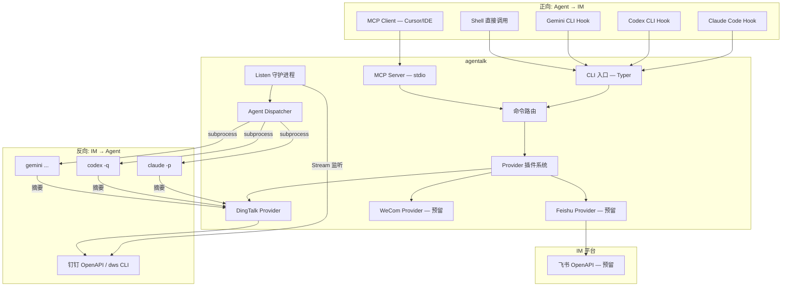

### claude-dingtalk-hooks-integration ###
创建独立开源项目 agentalk — IM 与 AI Coding Agent 的双向桥梁。本质是把 coding agent 作为 IM CLI 的智能调度中枢，支持双向通信：IM 用户通过 @机器人 把任务分发给 coding agent 执行，coding agent 也能通过 CLI/MCP/Hook 操作 IM（发消息、查日程、建待办等）。

# agentalk — IM 与 AI Coding Agent 的双向桥梁

## 背景与核心定位

**agentalk** 的本质是：**把 AI coding agent 当成调用 IM CLI 的能力去控制钉钉、开发代码等**。它是 IM 平台与 AI coding agent 之间的双向通信桥梁。

```
┌─────────────────────────────────────────────────────┐
│                    agentalk                          │
│                                                     │
│  正向: Coding Agent ──→ IM                          │
│    Hook/MCP/CLI → agentalk → 钉钉/飞书/微信         │
│    "任务完成了，发个通知"                              │
│                                                     │
│  反向: IM ──→ Coding Agent                          │
│    @机器人 → agentalk listen → coding CLI            │
│    "帮我重构 auth 模块"                               │
└─────────────────────────────────────────────────────┘
```

- **GitHub 仓库名**: `agentalk`
- **CLI 命令名**: `agentalk`
- **PyPI 包名**: `agentalk`
- **技术栈**: Python 3.11+, Typer, httpx, dingtalk-stream SDK
- **协议**: Apache-2.0

> [!IMPORTANT]
> **与 dws 的关系**: dws 是钉钉官方 Go CLI，只做钉钉单平台。agentalk 做多 IM 统一 CLI 层 + 双向 coding agent 桥接。钉钉部分底层可选调 `dws` 命令或直接用 Python SDK。

## 方案设计

### 整体架构



### 双向通信详解

**正向链路（Agent → IM）**:
- Coding agent 完成任务后，通过 Hook 自动调用 `agentalk notify`
- Coding agent 执行过程中，通过 MCP tool 主动操作 IM（发消息/查日程/建待办）
- 开发者在终端手动 `agentalk dingtalk chat send ...`

**反向链路（IM → Agent）**:
- `agentalk dingtalk listen` 启动长驻进程，通过钉钉 Stream SDK 监听 @机器人 消息
- 只处理 @机器人 的消息（安全，明确意图）
- 收到消息后，调用用户配置的 coding CLI（claude/codex/gemini 等）以非交互模式执行
- 执行完毕后，只发摘要回 IM（PR 链接、diff 统计），不发完整输出

### 认证策略

| 场景 | 认证方式 | 说明 |
|------|---------|------|
| 开发者手动操作 | OAuth device-flow（个人账号） | 以本人身份操作 IM |
| Hook 自动通知 | App Key/Secret（企业应用） | 无人值守场景 |
| listen 守护进程 | App Key/Secret（企业应用） | 长驻进程，机器人身份 |

凭证存储使用 `keyring` 库（系统 Keychain），自动刷新 token。

---

## Proposed Changes

### 项目结构

#### [NEW] 独立仓库 `agentalk/`

```
agentalk/
├── pyproject.toml
├── README.md
├── LICENSE                         # Apache-2.0
├── src/
│   └── agentalk/
│       ├── __init__.py
│       ├── __main__.py             # python -m agentalk
│       ├── cli.py                  # Typer 主命令组
│       ├── config.py               # ~/.agentalk/config.toml
│       ├── auth.py                 # 统一认证框架
│       ├── output.py               # 输出格式化（json/table/raw）
│       ├── mcp_server.py           # MCP Server 模式
│       │
│       ├── core/
│       │   ├── __init__.py
│       │   ├── provider.py         # BaseProvider(ABC)
│       │   ├── models.py           # Message, Contact, Event...
│       │   ├── registry.py         # Provider 注册与发现
│       │   └── dispatcher.py       # Agent Dispatcher（反向链路核心）
│       │
│       ├── providers/
│       │   ├── __init__.py
│       │   └── dingtalk/           # Phase 1
│       │       ├── __init__.py
│       │       ├── provider.py
│       │       ├── auth.py
│       │       ├── api.py
│       │       ├── dws.py          # dws CLI 桥接（可选）
│       │       ├── listener.py     # Stream 消息监听（反向链路）
│       │       └── services/
│       │           ├── chat.py
│       │           ├── contact.py
│       │           ├── calendar.py
│       │           ├── todo.py
│       │           └── doc.py
│       │
│       └── hooks/
│           ├── __init__.py
│           ├── notify.py           # Hook 通知入口
│           └── adapters.py         # 各工具数据格式适配
│
├── skills/                         # Agent Skills
│   ├── SKILL.md
│   └── references/
│       └── products/
│           └── dingtalk.md
│
├── hooks/                          # Hook 配置模板
│   ├── claude-code.json
│   ├── codex-cli.toml
│   ├── gemini-cli.json
│   └── opencode.toml
│
├── scripts/
│   ├── install.sh
│   ├── install-skills.sh
│   └── install-hooks.sh
│
└── tests/
    ├── test_cli.py
    ├── test_dingtalk_provider.py
    ├── test_mcp_server.py
    ├── test_listener.py
    └── test_dispatcher.py
```

---

### Phase 1: 核心框架 + 钉钉 Provider（正向）

#### [NEW] `src/agentalk/core/provider.py`

Provider 基类，所有 IM 平台的统一接口：

```python
from abc import ABC, abstractmethod

class BaseProvider(ABC):
    @abstractmethod
    async def send_message(self, target: str, content: str, msg_type: str = "text") -> dict: ...
    @abstractmethod
    async def search_contact(self, query: str, limit: int = 10) -> list[dict]: ...
    @abstractmethod
    async def list_calendar_events(self, date: str | None = None) -> list[dict]: ...
    @abstractmethod
    async def create_todo(self, title: str, **kwargs) -> dict: ...
    @abstractmethod
    async def search_docs(self, query: str, limit: int = 10) -> list[dict]: ...
    @abstractmethod
    def get_schema(self) -> dict:
        """返回本 Provider 支持的所有命令 schema（供 AI Agent 自省）"""
        ...
```

#### [NEW] `src/agentalk/cli.py`

```python
import typer
app = typer.Typer(name="agentalk", help="IM x AI Coding Agent 双向桥梁")

# 正向: Agent → IM
# agentalk dingtalk chat send --to "group_id" --text "hello"
# agentalk dingtalk contact search --query "从水"
# agentalk dingtalk todo create --title "Review PR"

# 反向: IM → Agent
# agentalk dingtalk listen                    # 启动监听守护进程
# agentalk dingtalk listen --agent claude     # 指定默认 coding agent

# 特殊命令
# agentalk mcp serve          # MCP Server 模式
# agentalk schema             # 列出所有 provider + 命令
# agentalk hook notify        # Hook 通知入口
# agentalk auth login <provider>
```

#### [NEW] `src/agentalk/providers/dingtalk/provider.py`

DingTalk Provider — 优先调 `dws`，fallback Python SDK：

```python
class DingTalkProvider(BaseProvider):
    def __init__(self):
        self._use_dws = shutil.which("dws") is not None

    async def send_message(self, target, content, msg_type="text"):
        if self._use_dws:
            return await self._dws_exec("chat", "message", "send-by-bot",
                "--group", target, "--text", content, "--yes")
        else:
            return await self._api_send(target, content, msg_type)
```

#### [NEW] `src/agentalk/mcp_server.py`

MCP Server 模式（stdio transport），自动将 CLI 命令映射为 MCP tools。

#### [NEW] `src/agentalk/hooks/notify.py`

Hook 通知入口，被 AI coding 工具 hook 调用：

```bash
# 用法: agentalk hook notify <source_tool> <event_type>
# stdin 接收 JSON 上下文
```

---

### Phase 2: 反向链路（IM → Agent）

#### [NEW] `src/agentalk/providers/dingtalk/listener.py`

钉钉 Stream 消息监听器 — 反向链路的入口：

```python
class DingTalkListener:
    """长驻进程，监听钉钉 @机器人 消息，分发给 coding agent"""

    def __init__(self, provider: DingTalkProvider, dispatcher: AgentDispatcher):
        self.provider = provider
        self.dispatcher = dispatcher

    async def start(self):
        """启动 Stream 监听，只处理 @机器人 的消息"""
        credential = dingtalk_stream.Credential(app_key, app_secret)
        client = dingtalk_stream.DingTalkStreamClient(credential)
        client.register_callback_handler(
            dingtalk_stream.ChatbotMessage.TOPIC,
            self._on_message
        )
        await client.start()

    async def _on_message(self, message: ChatbotMessage):
        # 1. 提取用户消息文本（去掉 @机器人 前缀）
        text = message.text.content.strip()
        # 2. 发送"收到，正在处理..."确认
        await self.provider.reply(message, "收到，正在处理...")
        # 3. 调用 coding agent 执行
        result = await self.dispatcher.dispatch(text, context={
            "sender": message.sender_id,
            "group": message.conversation_id,
            "provider": "dingtalk",
        })
        # 4. 发送摘要结果回 IM
        summary = self.dispatcher.summarize(result)
        await self.provider.reply(message, summary)
```

#### [NEW] `src/agentalk/core/dispatcher.py`

Agent Dispatcher — 核心调度器，把 IM 消息分发给 coding agent：

```python
class AgentDispatcher:
    """把 IM 消息路由到配置的 coding agent CLI 执行"""

    AGENTS = {
        "claude": {"cmd": ["claude", "-p"], "output_flag": "--output-format json"},
        "codex":  {"cmd": ["codex", "-q"],  "output_flag": ""},
        "gemini": {"cmd": ["gemini"],       "output_flag": ""},
    }

    def __init__(self, default_agent: str = "claude", work_dir: str = "."):
        self.default_agent = default_agent
        self.work_dir = work_dir

    async def dispatch(self, prompt: str, context: dict) -> dict:
        agent_config = self.AGENTS[self.default_agent]
        cmd = [*agent_config["cmd"], prompt]
        if agent_config["output_flag"]:
            cmd.append(agent_config["output_flag"])

        proc = await asyncio.create_subprocess_exec(
            *cmd, cwd=self.work_dir,
            stdout=asyncio.subprocess.PIPE,
            stderr=asyncio.subprocess.PIPE,
        )
        stdout, stderr = await proc.communicate()
        return {
            "exit_code": proc.returncode,
            "stdout": stdout.decode(),
            "stderr": stderr.decode(),
            "agent": self.default_agent,
        }

    def summarize(self, result: dict) -> str:
        """生成摘要 — 只发 PR 链接、diff 统计，不发完整输出"""
        if result["exit_code"] != 0:
            return f"执行失败 (exit {result['exit_code']})\n{result['stderr'][:200]}"
        # 提取 git diff stat / PR 链接等关键信息
        return self._extract_summary(result["stdout"])
```

---

### Phase 3: AI Coding 工具集成

#### [NEW] `hooks/` — Hook 配置模板

**Claude Code** (`.claude/settings.json`):
```jsonc
{
  "hooks": {
    "Stop": [{ "matcher": "", "hooks": [{ "type": "command", "command": "agentalk hook notify claude-code task_complete" }] }]
  }
}
```

**Codex CLI** (`.codex/config.toml`):
```toml
[[hooks]]
event = "on_agent_turn_end"
command = ["agentalk", "hook", "notify", "codex", "task_complete"]
```

#### [NEW] `skills/SKILL.md`

Agent Skills 文档体系，让 AI 工具开箱即用。

#### [NEW] `.mcp.json` 模板

```json
{
  "mcpServers": {
    "agentalk": {
      "command": "agentalk",
      "args": ["mcp", "serve"],
      "env": { "AGENTALK_DEFAULT_PROVIDER": "dingtalk" }
    }
  }
}
```

---

### Phase 4: 安装与分发

#### [NEW] `scripts/install-hooks.sh`

```bash
agentalk install-hooks          # 自动检测 + 注入
agentalk install-hooks --tool claude-code
```

#### [NEW] `scripts/install-skills.sh`

```bash
agentalk install-skills          # 全局
agentalk install-skills --local  # 当前项目
```

---

## 用户使用流程

### 安装
```bash
pip install agentalk    # 或 pipx install agentalk
agentalk auth login dingtalk
```

### 正向: Agent → IM
```bash
# CLI 直接调用
agentalk dingtalk chat send --to "group_123" --text "部署完成"
agentalk dingtalk todo create --title "Review PR #42"

# AI coding hook 自动通知（配置一次，之后自动）
agentalk install-hooks
```

### 反向: IM → Agent
```bash
# 启动监听守护进程
agentalk dingtalk listen --agent claude --work-dir /path/to/repo

# 之后在钉钉群里 @机器人：
# "@小鹰儿 帮我给 auth 模块加个 rate limiter"
# → agentalk 收到 → 调 claude -p "..." → 执行 → 发摘要回钉钉
```

---

## 与现有项目的关系

| 维度 | agentalk | cortex-agent | dws |
|------|----------|-------------|-----|
| **定位** | IM ↔ Coding Agent 双向桥 | 部门 AI 助手服务 | 钉钉官方 CLI |
| **形态** | CLI + MCP Server + Daemon | FastAPI Web 服务 | CLI |
| **IM 支持** | 多 IM（插件式） | 仅钉钉 | 仅钉钉 |
| **反向链路** | 有（listen + dispatcher） | 有（ChatBotHandler） | 无 |
| **Coding Agent** | 可调度 claude/codex/gemini 等 | 自有 AI Loop | 无 |
| **部署** | 本地 pip install | 服务器 | 本地 brew/go install |

---

## Verification Plan

### Automated Tests

```bash
pytest tests/ -v                                          # 单元测试
pytest tests/ -v -m integration --provider dingtalk       # 集成测试
npx @modelcontextprotocol/inspector -- agentalk mcp serve # MCP 调试
echo '{"text":"test"}' | agentalk hook notify claude-code task_complete  # Hook 测试
```

### Manual Verification

- `agentalk --help` 正常输出
- `agentalk dingtalk chat send` 成功发送钉钉消息
- `agentalk dingtalk listen` 能监听到 @机器人 消息
- `agentalk mcp serve` 被 Cursor/Claude Code 正确识别
- `agentalk install-hooks` 正确注入 hook 配置
- AI coding 工具任务完成后自动发钉钉通知
- 钉钉 @机器人 后 coding agent 正确执行并回发摘要


updateAtTime: 2026/5/15 11:23:46

planId: cf724d74-2a36-48f1-b663-cd13a14f2c19
